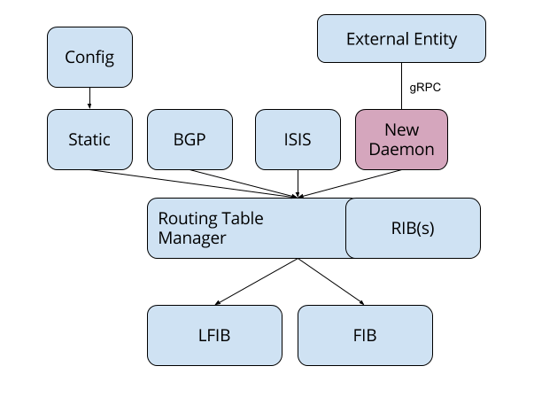
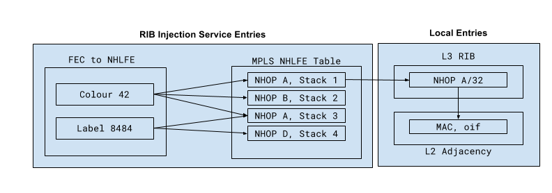

## gRPC Service for RIB Injection

Contributors: {robjs, ltd, pschultz, aashaikh}@google.com  
July 2017

## Overview

For a number of use cases in modern IP networks, the ability to inject routing
entries from an external source is advantageous. Currently, two approaches have
been taken for this:

*   Directly programming forwarding plane entries through OpenFlow, or P4 (in
    the
    [P4runtime](https://github.com/p4lang/PI/blob/master/proto/p4/p4runtime.proto)
    service).
*   Interacting with existing routing protocols to inject entries, e.g., use of
    BGP-LU for egress peer mapping, use of [BGP SR-TE Policy
    SAFI](https://tools.ietf.org/html/draft-previdi-idr-segment-routing-te-policy)
    for creation of segment routing LSPs.

There are challenges with these existing approaches. Directly programming the
forwarding plane assumes a single external controller (or set of controllers)
that have a view of the complete routing table that is required on a device and
hence can manage all forwarding entries. However, this operational mode becomes
significantly more complex when there are multiple (inter-dependent) sources of
candidate routing entries, some calculated by the device, and others calculated
by an external entity. For example, consider an injected path with a prefix
whose next-hop is resolved via a prefix learned from the IGP. In order to
withdraw or recalculate this path when the IGP prefix is withdrawn, there is a
need to share the state of the protocols running on the device with the
external entity, and possibly vice versa. This adds significant system
complexity - and makes the software stacks on the device and controller have a
tighter coupling than is desirable.

Use of an existing routing protocol has its own challenges - for example,
programming is typically a transactional process, and few routing protocols
are. For example, if a path is to be injected via BGP, there is no "ACK" that
the path has been programmed and installed by the device, and hence telemetry
signals (e.g., streaming the RIB and FIB contents) must be observed.
Additionally, routing protocols have their own semantics which must be worked
with in order to use them as distribution mechanisms - in BGP, for example, we
must always consider the NLRI that is to be used such that best path selection
doesn't interfere with the operation of injection. This approach can sometimes
leave fundamental information (required for the success of the injection
operation) in optional attributes which may or may not be included. This
increases implementation complexity, ultimately leading to lower system
reliability.

To this end, we propose an interface to the routing table on the device, that:

*   Acts as a client of the routing table manager on the device, such that the
    injected entries can be interdependent on the entries of other protocols,
    with resolution handled by the device itself.
*   Has transactional semantics, particularly a request/response design, such
    that the success or failure of an operation can be learned by the
programming entity.
*   Is separate from any existing protocol, such that its entries are alongside
    any other protocol, rather than aiming to inject entries as though they are
    coming from such a protocol.
*   Has a normalised interface across vendors, such that similarly to
    OpenConfig, gNMI and gNOI, translation to vendor-specific data models is
    performed on the device occurs on the device, where it can be done most
    effectively.
*   Is considered fundamentally as part of the control-plane of the device, not
    the management plane; such that entries are created as as though they are
    learnt via a dynamic routing protocol, not treated as ephemeral configuration
    of the device.

Figure 1 shows a high-level schematic of the envisaged service:

Building on the adoption of gRPC on network elements, we propose that the
interface is gRPC-based, such that connections to the clients is via gRPC
channels. The service's payload would be modelled in Protobuf. These protobuf
messages that form the payload of the RPCs, may be translated from other
sources (e.g., the interface could be modelled in YANG, and the structures
translated to protobuf via automated mechanisms).

## Example Use Cases for External Routing Entry Injection

### Installation of SR-TE Policies on a LER

With the advent of Segment Routing there is a requirement to be able to more
flexibly map traffic onto SR-TE paths. Such mapping falls into two cases:
packets that are labelled on ingress and those that are unlabelled. In each
case, the match criteria required differs:

*   **For labelled packets:** the ingress match criteria is the top MPLS label.
*   **For unlabelled packets:** the next-hop selection is performed based on an
    attribute placed on the unlabelled (IPv4/IPv6 Unicast) prefix that is
learnt by the system.

In both cases, the routing action required is to map to a set of (potentially
unequal cost) LFIB entries - consisting of one or more label stacks. Such label
stacks are resolved based on existing entries within the device's LFIB (which
may be populated themselves through the RIB injection service), which
themselves rely on L2 forwarding entries that are installed by the device.

We expect that entries that are installed are invalidated when they are no
longer viable - e.g., when the immediate next-hop of the system to which
entries are injected becomes invalid (i.e., the top-most segment of the label
stack becomes unresolvable within the local device's RIB).  Other than in such
cases, no other validation is expected from the system to which LSPs are
injected - since the semantics of labels within the supplied stacks may be
wholly opaque to the system to which they are installed.

#### Required RIB Attributes

<table>
  <tr>
   <td><strong>Ingress Match</strong>
   </td>
   <td><strong>Egress Mapping</strong>
   </td>
   <td><strong>Validation</strong>
   </td>
   <td><strong>Invalidation</strong>
   </td>
  </tr>
  <tr>
   <td>MPLS Label, Preference
   </td>
   <td>(W)ECMP set of MPLS label stacks.
   </td>
   <td rowspan="2" >Outer label can be resolved to a viable next-hop.
   </td>
   <td rowspan="2" >Outer label becomes unresolvable.
   </td>
  </tr>
  <tr>
   <td>Opaque "route colour" attribute for IPv[46] unicast routes, Preference
   </td>
   <td>W(ECMP) set of MPLS label stacks.
   </td>
  </tr>
</table>

### Installation of Backup Paths on an LSR

For networks that have detailed capacity offline capacity planning, some
assumptions must be made by automated systems as to how traffic is re-routed
during a failure. However, existing mechanisms such as TI-LFA use their own
(sometimes non-deterministic) mechanisms to determine which backup path is to
be selected. This has two challenges, particularly:

*   Ensuring that such algorithms are consistently implemented in a
    deterministic manner on network devices has proven to be difficult.
    Deterministic backup path placement is essential for capacity planning process
    to understand that the network's performance and availability requirements can
    be met during failure events.
*   The backup paths that are required to meet network availability and
    performance requirements may not be possible to be found by distributed
    computation, or require significant computational complexity at the device -
    potentially requiring path selection algorithms that are only applicable to a
    particular operator.

We propose that a gRPC-based RIB injection service is utilised to install
backup paths that are computed off the device. The granularity of entries is
expected to be on a per-FEC basis -- that is to say, in RSVP-TE per-LSP, and
within SR-TE per-SID.

Installed entries must have similar semantics as SR-TE policy entries, i.e.,
match on a particular MPLS label and consist of one or more label stacks that
are to be used for rerouting traffic. It is expected that such entries are
pre-installed within the forwarding plane, such that post-detection failover
times of O(50msec) can be achieved.  Since implementations may have different
data structures that are used per FIB - which may be platform-dependent - we do
not proposed that a faithful representation of the FIB data structure is used
for these backup paths. Rather, we propose to express the required backup
policies in terms of an ingress match criteria (in this case MPLS label), and
an egress set of (potentially unequal weight) MPLS forwarding entries. In the
case that multiple entries share the same backup path, we expect the device to
calculate the optimal FIB layout (be it per label forwarding entries, or
linking a multiple forwarding entries to a next-hop construct associated with
the backup path.

#### Required RIB Attributes

<table>
  <tr>
   <td><strong>Ingress Match</strong>
   </td>
   <td><strong>Egress Mapping</strong>
   </td>
   <td><strong>Validation</strong>
   </td>
   <td><strong>Invalidation</strong>
   </td>
  </tr>
  <tr>
   <td>MPLS Label, Preference

(<em>Must be possible to mark as an entry to be installed in the FIB as backup)</em>
   </td>
   <td>(W)ECMP set of MPLS label stacks.
   </td>
   <td>Outer label can be resolved to a viable next-hop.
   </td>
   <td>Outer label becomes unresolvable.
   </td>
  </tr>
</table>

### Dynamic Injection of Next-Hop Service Labels

In some cases, there is a requirement to map particular traffic to certain
egress interfaces, or to a particular remote service that is indicated by an
MPLS label that can be resolved in the RIB. We envisage that the RIB injection
service proposed in this document could be re-used to achieve this - such that
routing entries can be injected to influence this traffic routing. In these
cases, the match criteria is similar to that required for SR-TE policies -
i.e., an ingress MPLS label, or a colour used to resolve IP prefixes that are
learned from elsewhere in the RIB. In addition to weighted sets of MPLS label
stacks, there is also a requirement to route traffic towards an IP next-hop
which will be resolved elsewhere in the RIB.

#### Required RIB Attributes

<table>
  <tr>
   <td><strong>Ingress Match</strong>
   </td>
   <td><strong>Egress Mapping</strong>
   </td>
   <td><strong>Validation</strong>
   </td>
   <td><strong>Invalidation</strong>
   </td>
  </tr>
  <tr>
   <td>MPLS Label, Preference
   </td>
   <td>(W)ECMP set of MPLS label stacks.
   </td>
   <td>Outer label can be resolved to a viable next-hop.
   </td>
   <td>Outer label becomes unresolvable.
   </td>
  </tr>
  <tr>
   <td>MPLS Label, Preference
   </td>
   <td>IP[v46] next-hop with label stack
   </td>
   <td>IPv[46] next-hop can be reached.
   </td>
   <td>IPv[46] next-hop becomes unresolvable.
   </td>
  </tr>
</table>

## Tying Injected Entries to the Liveliness of gRPC Client

We expect that all entries that are installed by a gRPC client are only
maintained during the time that a (long-lived) RPC remains open. In keeping
with other control plane approaches, we expect that redundancy of entries can
be maintained by having >1 source of injected entries. Where there is a
requirement to persist entries that are to be installed within the gRPC service
(e.g., static SR-TE LSPs), we expect that this is achieved through the
management plane of the system.

Since there is a long-lived RPC, we expect that there is a requirement to have
a keepalive mechanism to ensure that the client is alive, although this could
be achieved simply by tracking TCP session liveliness, it is possible that the
gRPC
[keepalive](https://github.com/grpc/grpc-go/blob/master/keepalive/keepalive.go)
mechanism could be utilised, requiring little to no additional machinery to
achieve such functionality. The requirement for such a keepalive is to
determine a non-responsive client from one that is simply silent, such that in
the case that >1 source of programming entries exists then stale client
information can be determined.

Since the possibility of having multiple clients introduces the possibility of
requirements for tiebreaking, we propose that the implementation is kept as
simple possible, and the client with the lowest client address when expressed
in the form of an 128-bit number is selected. We expect that the remote systems
are responsible for ensuring consistency of announcements.

## Logic for Limited Validation

It should be noted that the validation logic we propose throughout is _as
minimal as possible whilst allowing invalidation - _that is to say, we do not
expect correctness checks to be performed for particular injected entries, but
the system is expected to determine each entry's viability before installing it
(i.e., is the next-hop set resolvable). As such, we are proposing an approach
that is centred around being as liberal as possible such that we minimise
development changes in the future for use cases that we did not yet forsee.
This relies strictly on the remote systems being conservative in what they
send. As such, this approach is at odds with other routing protocols, which
attempt to maintain their correctness -- we consider that it is difficult
across such an API implementation boundary to capture all semantics of
correctness, and therefore simply propose that the receiving device ensures
that the entry can be viable before utilising it within its RIB.

## Performance Requirements

We expect that the programming via the gRPC interface discussed herein is that
of a control plane protocol - i.e., O(msec) between reception of an entry and
its installation within the FIB. It is not expected that there is a complex
commit process implemented. To this end, we expect each entry that is to be
installed within the RIB to be treated as a separate transaction - with an
external system responsible for sequencing installation of entries if required.

We expect that the programming of entries is isolated from the performance of
other gRPC services on the system -- such that large volumes of telemetry or
configuration push/retrieval does not impact the performance of the control
plane convergence of the system.

## Data Model for Proposed RIB Service

We propose that the data model for the gRPC RIB injection service uses an
abstracted view of the RIB of the device - particularly the OpenConfig
[AFT](https://github.com/openconfig/public/blob/master/release/models/aft/openconfig-aft.yang)
model. This schema allows the instantiation of:

*   RIB entries (labelled or unlabelled) with attributes of the relevant
    address family.
*   Mapping to a (set of) next-hops. It is suggested that these next-hops are
    separated out from the forwarding entries (such that a AFT entry references
    a next-hop that can be shared).

We propose that the YANG model that describes the AFT schema is transformed[^1]
to Protobuf to be carried within the payload of the RPC. The advantage of using
the same schema as the AFT model is that there is no requirement for RPCs to
retrieve the injected RIB entries, but rather gNMI can be used and entries in
the AFT are guaranteed to be mappable to the existing gNMI `Get` and
`Subscribe` RPCs. This allows for the RIB injection service to be as simple as
possible.

## Interface Definition for the RIB Injection Service

We propose a simple RPC service - such as the one defined in this package - is
used for the RIB injection. As referenced above, retrieval of current state is
expected to be via gNMI and hence the service only defines an RPC to modify the
AFT . Bi-directional streaming is used to allow asynchronous application of
transactions and their ACK from the system.

<!-- Footnotes themselves at the bottom. -->
## Notes

[^1]:
     The process of machine translating YANG to Protobuf is implemented in the
     [ygot](https://github.com/openconfig/ygot) library. We envisage that a
     versioned copy of the generated protobuf is published.
